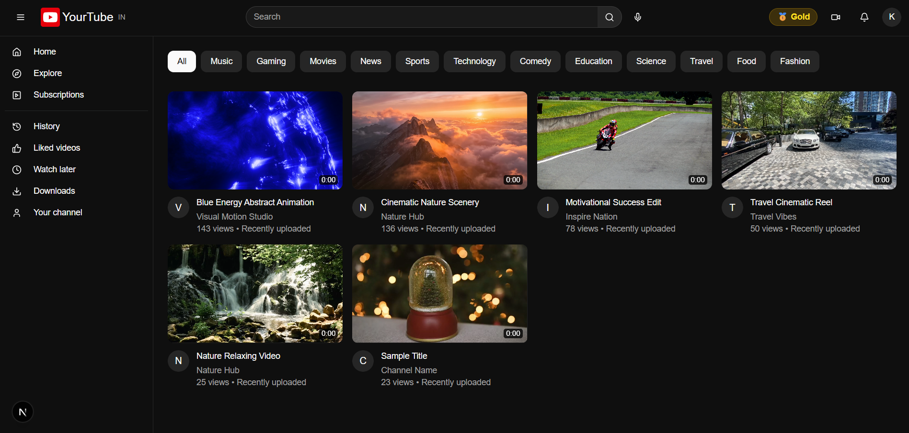
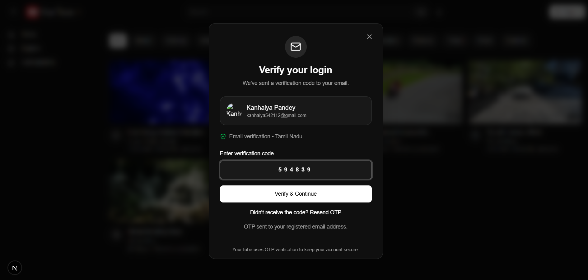
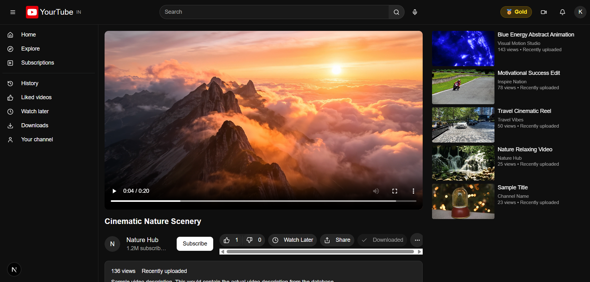
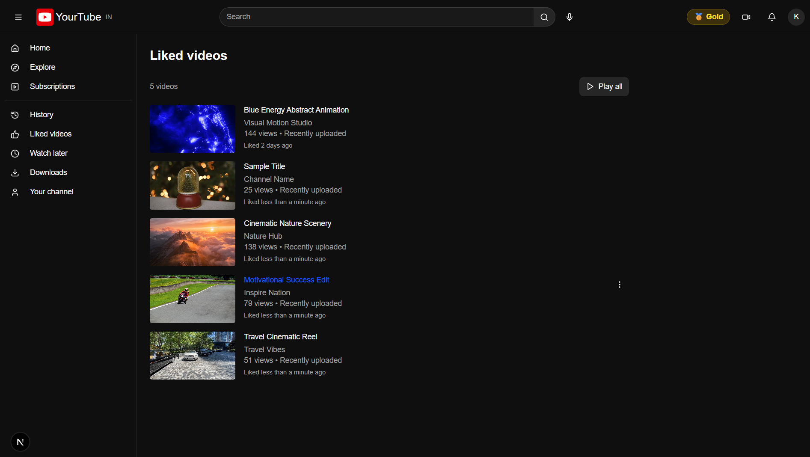
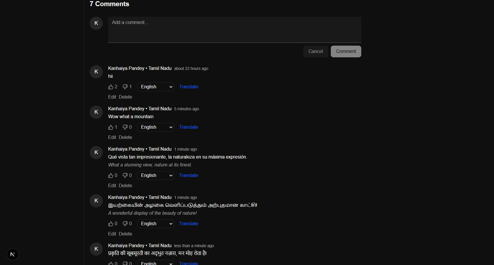
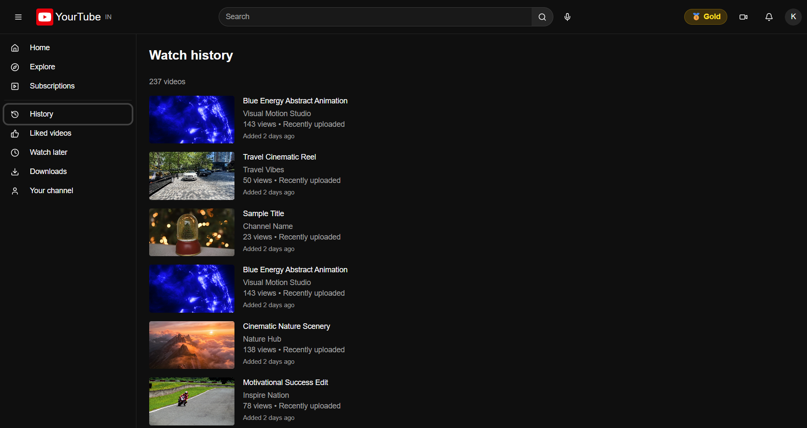
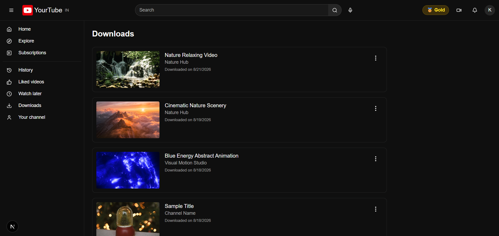
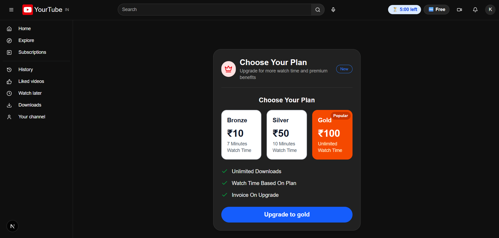
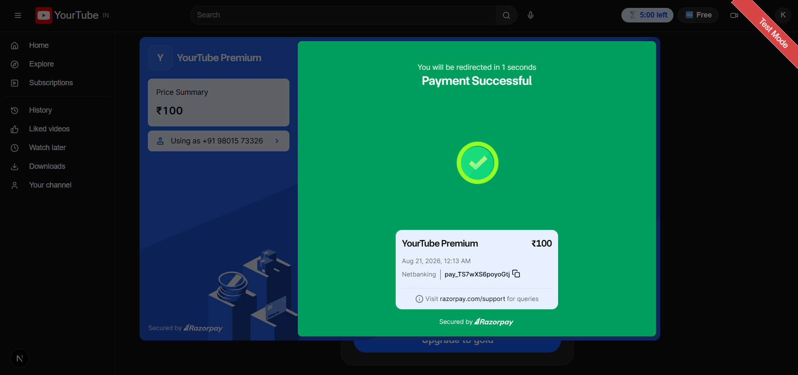
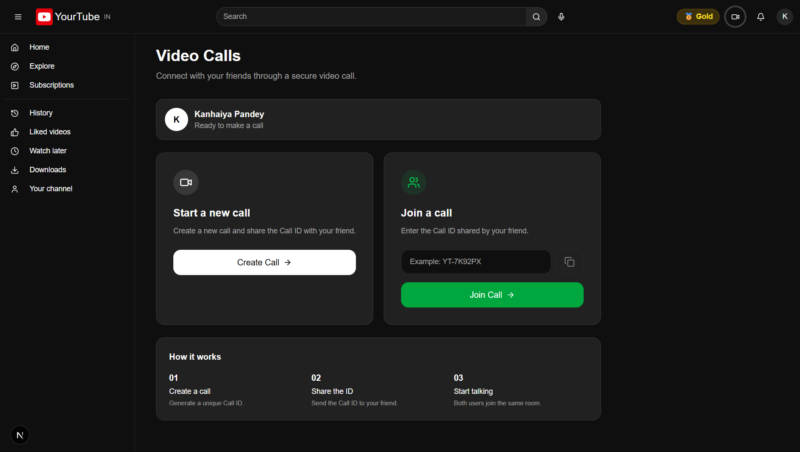

# 🎬 YourTube — Full-Stack YouTube Clone

<p align="center">
  <strong>A feature-rich full-stack YouTube-style video streaming platform built with Next.js, React, TypeScript, Node.js, Express and MongoDB.</strong>
</p>

<p align="center">
  
  
  
  
  
  
  
</p>

<p align="center">
  
  
  
  
  
  
</p>

<p align="center">
  
  
</p>

---

## 📌 Table of Contents

1. [Project Overview](#1-project-overview)
2. [Problem Statement](#2-problem-statement)
3. [Solution](#3-solution)
4. [Objectives](#4-objectives)
5. [Key Features](#5-key-features)
6. [Technology Stack](#6-technology-stack)
7. [System Architecture](#7-system-architecture)
8. [Application Workflow](#8-application-workflow)
9. [Repository Structure](#9-repository-structure)
10. [Frontend Architecture](#10-frontend-architecture)
11. [Backend Architecture](#11-backend-architecture)
12. [Database Design](#12-database-design)
13. [Feature Details](#13-feature-details)
14. [Authentication and OTP](#14-authentication-and-otp)
15. [Video Management](#15-video-management)
16. [Social Interactions](#16-social-interactions)
17. [Watch Later and History](#17-watch-later-and-history)
18. [Download System](#18-download-system)
19. [Premium Plans](#19-premium-plans)
20. [Razorpay Payment System](#20-razorpay-payment-system)
21. [Email and SMS Notifications](#21-email-and-sms-notifications)
22. [Watch-Time Management](#22-watch-time-management)
23. [Real-Time Video Calling](#23-real-time-video-calling)
24. [UI, Theme and User Experience](#24-ui-theme-and-user-experience)
25. [Screenshots](#25-screenshots)
26. [Environment Variables](#26-environment-variables)
27. [Installation Guide](#27-installation-guide)
28. [Running the Project](#28-running-the-project)
29. [Production Build](#29-production-build)
30. [Deployment](#30-deployment)
31. [API Reference](#31-api-reference)
32. [Security Considerations](#32-security-considerations)
33. [Troubleshooting](#33-troubleshooting)
34. [Future Enhancements](#34-future-enhancements)
35. [Project Status](#35-project-status)
36. [Author](#36-author)
37. [License](#37-license)

---

# 1. Project Overview

**YourTube** is a full-stack YouTube-style video streaming and content-sharing platform.

The project is designed to reproduce the core experience of a modern video platform while also implementing additional application-level features such as:

- User authentication
- OTP verification
- Video upload and playback
- Search and content discovery
- Likes and dislikes
- Comments and comment reactions
- Watch Later
- Watch History
- Video downloads
- Premium subscription plans
- Razorpay payments
- Payment verification
- Invoice email
- Email OTP
- SMS OTP through Twilio
- Watch-time restrictions
- Real-time video calling using Socket.IO and WebRTC
- Responsive and modern UI
- Theme-related user experience

The repository contains two major applications:

```text
youtube-clone/
│
├── yourtube/    → Next.js + React + TypeScript frontend
│
└── server/      → Node.js + Express + MongoDB backend
```

The project is intended as a complete full-stack learning and portfolio project rather than a simple UI clone.

---

# 2. Problem Statement

Traditional beginner YouTube-clone projects generally focus only on reproducing the visual interface.

That approach does not demonstrate how a production-style application handles:

- Authentication
- Persistent user data
- Video management
- API communication
- File uploads
- Social interactions
- Access control
- Subscription logic
- Payments
- Notifications
- Watch-time limits
- Real-time communication

A more complete system is required to demonstrate how a modern video platform can connect frontend, backend, database and external services into one application.

---

# 3. Solution

YourTube solves this problem by implementing a complete client-server architecture.

The frontend provides the user-facing experience, while the backend exposes APIs and handles business logic. MongoDB stores persistent application data, and external services provide specialized functionality such as payments, email, SMS and real-time communication.

```text
Browser
   ↓
Next.js / React / TypeScript
   ↓
Axios / Socket.IO
   ↓
Node.js / Express
   ↓
Controllers
   ↓
Mongoose Models
   ↓
MongoDB
```

External integrations such as Razorpay, Nodemailer, Twilio and WebRTC are connected where required.

---

# 4. Objectives

The main objectives of YourTube are:

1. Build a complete full-stack video platform.
2. Practice modern React and Next.js development.
3. Build REST APIs using Node.js and Express.
4. Use MongoDB and Mongoose for persistent data.
5. Implement authentication and protected operations.
6. Implement video upload, playback and view tracking.
7. Add social interaction features.
8. Implement premium plans and payment processing.
9. Add email and SMS communication.
10. Implement watch-time based access control.
11. Implement real-time video calling.
12. Create a responsive and professional user interface.
13. Structure the project so it can be deployed as separate frontend and backend services.

---

# 5. Key Features

## 👤 Authentication

- User login
- User profile update
- JWT-based authentication support
- OTP generation and verification
- Email OTP
- SMS OTP
- User-specific content

## 🎥 Video Platform

- Upload videos
- Store uploaded video files
- Display available videos
- Video playback
- View count tracking
- Watch-time tracking
- Related video presentation
- Search and explore experiences
- Channel-oriented content

## ❤️ Social Features

- Like videos
- Dislike videos
- View liked videos
- Add comments
- Edit comments
- Delete comments
- React to comments
- Watch Later
- Watch History

## ⬇️ Downloads

- Download videos
- View downloads
- Check download status
- Remove downloaded items
- Stream downloaded files through backend endpoints
- Premium-aware download access

## 💎 Premium Plans

| Plan | Price | Watch-Time Limit |
|------|------:|------------------|
| Free | ₹0 | 5 minutes |
| Bronze | ₹10 | 7 minutes |
| Silver | ₹50 | 10 minutes |
| Gold | ₹100 | Unlimited |

## 💳 Payments

- Razorpay integration
- Premium order creation
- Payment signature verification
- Plan upgrade
- Premium status update
- Invoice email

## 📧 Notifications

- Email OTP
- SMS OTP
- Subscription invoice email

## 📞 Real-Time Communication

- Room-based video calling
- Socket.IO signaling
- WebRTC offer/answer exchange
- ICE candidate exchange
- Camera state synchronization
- Microphone state synchronization
- Join/leave room events

---

# 6. Technology Stack

## Frontend

| Technology | Purpose |
|------------|---------|
| Next.js 15.3.3 | React framework and application routing |
| React 19 | Component-based UI |
| TypeScript 5 | Type-safe frontend development |
| Tailwind CSS 4 | Utility-first styling |
| Axios | REST API communication |
| Socket.IO Client | Real-time communication |
| Firebase | Frontend/service integration |
| Radix UI | Accessible UI primitives |
| Lucide React | Icons |
| Sonner | Toast notifications |
| Next Themes | Theme management |
| date-fns | Date/time utilities |
| clsx | Conditional class handling |
| tailwind-merge | Tailwind class merging |

## Backend

| Technology | Purpose |
|------------|---------|
| Node.js | JavaScript runtime |
| Express.js 5 | REST API server |
| MongoDB | Primary database |
| Mongoose | MongoDB ODM |
| JWT | Authentication/token support |
| Multer | File upload handling |
| Express FileUpload | File handling support |
| Nodemailer | Email delivery |
| OTP Generator | OTP generation |
| Twilio | SMS/OTP |
| Razorpay | Payment processing |
| Socket.IO | Real-time signaling |
| dotenv | Environment configuration |
| CORS | Cross-origin communication |

## External / Platform Technologies

| Technology | Purpose |
|------------|---------|
| Razorpay | Premium payments |
| Gmail SMTP | Email delivery |
| Twilio | SMS delivery |
| Firebase | Application integration |
| Socket.IO | Real-time signaling |
| WebRTC | Peer-to-peer audio/video |
| Vercel | Frontend deployment |
| Render | Backend deployment |

---

# 7. System Architecture

YourTube follows a layered full-stack architecture.

```text
┌─────────────────────────────────────────────────────────────┐
│                         USER / BROWSER                      │
└──────────────────────────────┬──────────────────────────────┘
                               │
                               ▼
┌─────────────────────────────────────────────────────────────┐
│                     FRONTEND APPLICATION                    │
│                                                             │
│              Next.js + React + TypeScript                   │
│                                                             │
│ Pages │ Components │ Axios │ Theme │ Notifications          │
└──────────────────────────────┬──────────────────────────────┘
                               │
                     HTTP / REST API
                               │
                      Socket.IO / WebRTC
                               │
                               ▼
┌─────────────────────────────────────────────────────────────┐
│                     BACKEND APPLICATION                     │
│                                                             │
│                    Node.js + Express                        │
│                                                             │
│ Routes → Controllers → Models → Database                    │
│                                                             │
│ Auth │ Video │ Like │ Comment │ History │ Download          │
│ Payment │ OTP │ Watch Time │ Real-Time Communication        │
└───────────────────────┬───────────────────┬─────────────────┘
                        │                   │
                        ▼                   ▼
             ┌──────────────────┐  ┌─────────────────────────┐
             │     MongoDB      │  │   External Services     │
             │                  │  │                         │
             │ Users            │  │ Razorpay                │
             │ Videos           │  │ Gmail/Nodemailer        │
             │ Comments         │  │ Twilio                  │
             │ Likes            │  │ Firebase                │
             │ History          │  │ Socket.IO               │
             │ Downloads        │  │ WebRTC                  │
             │ Watch Later      │  │                         │
             └──────────────────┘  └─────────────────────────┘
```

## Request Flow

```text
User Action
    ↓
Next.js Page / Component
    ↓
Axios Request
    ↓
Express Route
    ↓
Controller
    ↓
Mongoose Model
    ↓
MongoDB
    ↓
JSON Response
    ↓
Frontend State Update
    ↓
Updated UI
```

---

# 8. Application Workflow

## General Workflow

```text
Open YourTube
      ↓
Browse / Search Videos
      ↓
Select a Video
      ↓
Watch Video
      ↓
View Count + Watch Time Updated
      ↓
User Can Like / Comment / Save / Download
      ↓
User Can Upgrade to Premium
      ↓
Razorpay Payment
      ↓
Payment Signature Verification
      ↓
Premium Plan Activated
      ↓
Invoice Email Sent
```

## Video Calling Workflow

```text
User A
  ↓
Create / Join Room
  ↓
Socket.IO
  ↓
User B Joins Same Room
  ↓
WebRTC Offer
  ↓
WebRTC Answer
  ↓
ICE Candidates
  ↓
Peer-to-Peer Connection
  ↓
Audio + Video Communication
```

---

# 9. Repository Structure

```text
youtube-clone/
│
├── docs/
│   ├── comments.png
│   ├── downloads.png
│   ├── history.png
│   ├── home.png
│   ├── likes.png
│   ├── login.png
│   ├── payment.png
│   ├── premium.png
│   ├── video-call.png
│   └── video-player.png
│
├── server/
│   ├── Models/
│   ├── controllers/
│   ├── filehelper/
│   ├── middleware/
│   ├── routes/
│   ├── uploads/
│   ├── utils/
│   ├── index.js
│   ├── package.json
│   └── package-lock.json
│
├── yourtube/
│   ├── public/
│   ├── src/
│   ├── components.json
│   ├── next.config.ts
│   ├── package.json
│   ├── package-lock.json
│   ├── postcss.config.mjs
│   └── tsconfig.json
│
├── .gitignore
└── PROJECT_DOCUMENTATION.md
```

---

# 10. Frontend Architecture

The frontend is a Next.js application using the Pages Router.

```text
yourtube/
│
├── public/
│
├── src/
│   ├── components/
│   ├── lib/
│   ├── pages/
│   └── styles/
│
├── components.json
├── next.config.ts
├── package.json
├── postcss.config.mjs
└── tsconfig.json
```

## Main Pages / Areas

The application contains page areas for:

- Home
- Call
- Channel
- Downloads
- Explore
- History
- Liked Videos
- Premium
- Search
- Subscriptions
- Watch Later

The main entry point is:

```text
yourtube/src/pages/index.tsx
```

## Reusable Components

The component architecture separates reusable UI from page-level logic.

Typical responsibilities include:

- Navigation
- Video cards
- Video player
- Related videos
- Comments
- Likes
- Watch Later
- History
- Downloads
- Premium UI
- Payment UI
- Video calling
- Dialogs
- Forms
- Notifications

---

# 11. Backend Architecture

The backend entry point is:

```text
server/index.js
```

The backend is organized into:

```text
server/
├── Models/
├── controllers/
├── filehelper/
├── middleware/
├── routes/
├── uploads/
├── utils/
└── index.js
```

## Backend Responsibilities

- Receive HTTP requests
- Validate and process requests
- Execute business logic
- Communicate with MongoDB
- Handle uploaded files
- Authenticate users
- Manage premium access
- Process payments
- Send OTPs
- Send emails
- Handle downloads
- Track watch time
- Provide Socket.IO signaling

---

# 12. Database Design

MongoDB is used as the primary database and Mongoose is used for schema/model management.

The repository contains models for:

| Model | Purpose |
|-------|---------|
| Auth | User information and account data |
| Video | Video metadata and video information |
| Comment | Video comments and comment interactions |
| Like | Video like/dislike information |
| WatchLater | Saved videos |
| History | Watched videos/history |
| Download | Download-related records |

Conceptually:

```text
User
 │
 ├── Videos / Activity
 ├── Likes
 ├── Comments
 ├── Watch Later
 ├── History
 ├── Downloads
 └── Premium Plan
```

---

# 13. Feature Details

## 13.1 User Registration / Login

Users can access the platform through the authentication system.

The backend exposes:

```text
POST /user/login
PATCH /user/update/:id
```

User information is also used by the frontend to associate requests with the current account.

---

## 13.2 Video Upload

Videos are uploaded through a multipart form request.

The backend uses Multer/file handling utilities and stores uploaded files in the server's upload directory.

Endpoint:

```text
POST /video/upload
```

The upload field used by the route is:

```text
file
```

---

## 13.3 Video Listing

All available videos can be retrieved through:

```text
GET /video/getall
```

The frontend uses this data to build video discovery interfaces.

---

## 13.4 View Tracking

Video views are updated using:

```text
PATCH /video/view/:id
```

This allows the frontend to notify the backend when a video view should be recorded.

---

## 13.5 Likes and Dislikes

Like functionality supports:

```text
GET  /like/:userId
POST /like/:videoId
```

The first endpoint retrieves liked videos for a user, while the second handles like/dislike interaction for a video.

---

## 13.6 Comments

Comment functionality includes:

- Retrieve comments
- Post comments
- Edit comments
- Delete comments
- React to comments

Endpoints:

```text
GET    /comment/:videoid
POST   /comment/postcomment
DELETE /comment/deletecomment/:id
POST   /comment/editcomment/:id
PATCH  /comment/reaction/:id
```

---

## 13.7 Watch Later

Users can save videos for later.

Endpoints:

```text
GET  /watch/:userId
POST /watch/:videoId
```

---

## 13.8 Watch History

The history module provides:

```text
GET  /history/:userId
POST /history/views/:videoId
POST /history/:videoId
```

This supports retrieving history and recording video activity.

---

# 14. Authentication and OTP

YourTube includes OTP-based verification functionality.

## OTP Endpoints

```text
POST /otp/send
POST /otp/verify
```

OTP functionality can use:

- Email
- SMS through Twilio

The application generates an OTP and delivers it through the configured communication service.

The OTP message is designed to expire after five minutes.

---

# 15. Video Management

The video module supports:

- Upload
- Listing
- Playback
- View tracking
- Watch-time tracking
- Related video presentation
- Download integration

Main endpoints:

```text
POST  /video/upload
GET   /video/getall
PATCH /video/view/:id
```

The backend also creates and serves an uploads directory.

---

# 16. Social Interactions

YourTube provides several engagement mechanisms:

### Likes

Users can like/dislike videos and access their liked-video collection.

### Comments

Users can create, edit and delete comments.

### Comment Reactions

Comments support reaction handling through:

```text
PATCH /comment/reaction/:id
```

### Watch Later

Users can save videos for future viewing.

### History

Video activity can be recorded and displayed through the history page.

---

# 17. Watch Later and History

These features improve personalization.

## Watch Later

```text
GET  /watch/:userId
POST /watch/:videoId
```

## History

```text
GET  /history/:userId
POST /history/views/:videoId
POST /history/:videoId
```

---

# 18. Download System

The download module is protected by authentication middleware.

Endpoints:

```text
POST   /download/
GET    /download/
GET    /download/check/:videoid
DELETE /download/:videoid
GET    /download/file/:videoid
GET    /download/watch/:videoid
```

The system supports:

- Creating download records
- Viewing downloads
- Checking whether a video is downloaded
- Removing a download
- Streaming a downloaded file
- Watching a stored video file

---

# 19. Premium Plans

YourTube implements a tiered access system.

| Plan | Price | Watch Limit |
|------|------:|------------:|
| Free | ₹0 | 5 minutes |
| Bronze | ₹10 | 7 minutes |
| Silver | ₹50 | 10 minutes |
| Gold | ₹100 | Unlimited |

Premium information is associated with the user account.

When a plan is upgraded, the backend updates:

- Premium status
- Selected plan
- Watch-time limit
- Used watch time

Gold uses an unlimited watch-time configuration.

---

# 20. Razorpay Payment System

Razorpay is used for premium plan payments.

## Payment Endpoints

```text
POST /payment/create-order
POST /payment/upgrade
```

## Payment Flow

```text
Select Premium Plan
       ↓
Create Razorpay Order
       ↓
Complete Payment
       ↓
Receive Payment ID / Order ID / Signature
       ↓
Backend Verifies Signature
       ↓
User Premium Plan Updated
       ↓
Watch-Time Limit Updated
       ↓
Invoice Email Sent
```

The backend verifies the Razorpay signature using HMAC SHA-256 before activating the plan.

Plan amounts are represented in paise when creating Razorpay orders:

```text
Bronze → ₹10  → 1000 paise
Silver → ₹50  → 5000 paise
Gold   → ₹100 → 10000 paise
```

---

# 21. Email and SMS Notifications

## Email

Nodemailer with Gmail SMTP is used for:

- Login OTP
- Subscription invoice
- Payment confirmation

The invoice email includes:

- User name
- Premium plan
- Amount paid
- Transaction ID
- Date
- Premium benefits

## SMS

Twilio is used for OTP delivery.

The implementation accepts Indian mobile numbers and formats 10-digit numbers with the `+91` country code.

---

# 22. Watch-Time Management

Watch time is managed through dedicated backend endpoints:

```text
POST /watchtime/update
GET  /watchtime/status/:userId
```

The system can track:

- Current user
- Watch time used
- Watch-time limit
- Plan-based access

Conceptually:

```text
Free     → 5 minutes
Bronze   → 7 minutes
Silver   → 10 minutes
Gold     → Unlimited
```

When a user upgrades, their watch-time usage is reset according to the current implementation.

---

# 23. Real-Time Video Calling

The application includes a video-calling experience using:

- Socket.IO
- WebRTC
- Browser media APIs

## Socket Events

The backend handles events including:

```text
connection
join-room
user-joined
offer
answer
ice-candidate
leave-room
user-left
disconnect
toggle-microphone
toggle-camera
```

## Communication Architecture

```text
User A Browser
     │
     │ Socket.IO signaling
     ▼
Node.js + Socket.IO
     │
     │ Signaling
     ▼
User B Browser

After negotiation:
User A  ←──── WebRTC Peer Connection ────→  User B
```

Socket.IO is responsible for signaling while WebRTC handles the peer-to-peer media connection.

---

# 24. UI, Theme and User Experience

The frontend focuses on a modern video-platform experience.

The application includes:

- Responsive layouts
- Video-card based content discovery
- Dedicated pages for major features
- Dark/light theme support
- Theme management with Next Themes
- Toast notifications through Sonner
- Lucide icons
- Radix UI primitives
- Tailwind CSS styling
- Reusable components
- Video player interactions
- Dedicated premium and payment interfaces

---

# 25. Screenshots

All screenshots are stored inside the `docs/` directory.

## Home Page



## Login



## Video Player



## Likes



## Comments



## Watch History



## Downloads



## Premium Plans



## Razorpay / Payment



## Video Calling



---

# 26. Environment Variables

Environment variables are required for the backend and frontend.

**Never commit real secrets to GitHub.**

## Backend `.env`

Create:

```text
server/.env
```

Recommended variables based on the current codebase:

```env
PORT=5000
DB_URL=your_mongodb_connection_string

JWT_SECRET=your_jwt_secret

EMAIL_USER=your_gmail_address
EMAIL_PASS=your_gmail_app_password

TWILIO_ACCOUNT_SID=your_twilio_account_sid
TWILIO_AUTH_TOKEN=your_twilio_auth_token
TWILIO_PHONE_NUMBER=your_twilio_phone_number

RAZORPAY_KEY_ID=your_razorpay_key_id
RAZORPAY_KEY_SECRET=your_razorpay_key_secret
```

### Important

The current backend explicitly reads:

```text
DB_URL
EMAIL_USER
EMAIL_PASS
TWILIO_ACCOUNT_SID
TWILIO_AUTH_TOKEN
TWILIO_PHONE_NUMBER
RAZORPAY_KEY_ID
RAZORPAY_KEY_SECRET
PORT
```

If authentication-related code in a particular branch requires an additional JWT secret, define the corresponding variable expected by that code.

## Frontend `.env.local`

Create:

```text
yourtube/.env.local
```

At minimum, configure:

```env
NEXT_PUBLIC_BACKEND_URL=http://localhost:5000
```

For production:

```env
NEXT_PUBLIC_BACKEND_URL=https://your-backend-domain
```

The frontend Axios instance reads `NEXT_PUBLIC_BACKEND_URL` as the backend base URL.

### Environment Variable Security

Do not commit:

```text
.env
.env.local
.env.production
```

or any file containing:

- Passwords
- API secrets
- Razorpay secret key
- Twilio auth token
- Email passwords
- Database credentials

---

# 27. Installation Guide

## Prerequisites

Install the following:

- Node.js
- npm
- MongoDB or MongoDB Atlas
- Git
- A modern browser

Optional external-service accounts:

- Razorpay
- Twilio
- Gmail with an App Password
- Firebase

---

## Step 1 — Clone the Repository

```bash
git clone https://github.com/kanhaiya28pandey/youtube-clone.git
cd youtube-clone
```

---

## Step 2 — Install Backend Dependencies

```bash
cd server
npm install
```

---

## Step 3 — Configure Backend Environment

Create:

```text
server/.env
```

Add the required values described in the Environment Variables section.

---

## Step 4 — Install Frontend Dependencies

Open another terminal:

```bash
cd youtube-clone/yourtube
npm install
```

---

## Step 5 — Configure Frontend Environment

Create:

```text
yourtube/.env.local
```

Add:

```env
NEXT_PUBLIC_BACKEND_URL=http://localhost:5000
```

---

# 28. Running the Project

## Start Backend

From:

```text
youtube-clone/server
```

run:

```bash
npm start
```

The backend uses Nodemon and the current default port is:

```text
5000
```

You can verify the backend with:

```text
http://localhost:5000/
```

Expected response:

```text
You tube backend is working
```

## Start Frontend

From:

```text
youtube-clone/yourtube
```

run:

```bash
npm run dev
```

The frontend is normally available at:

```text
http://localhost:3000
```

## Run Both

Use two terminals:

### Terminal 1

```bash
cd server
npm start
```

### Terminal 2

```bash
cd yourtube
npm run dev
```

Then open:

```text
http://localhost:3000
```

---

# 29. Production Build

## Frontend

```bash
cd yourtube
npm run build
npm start
```

## Backend

The backend can be started with:

```bash
cd server
npm start
```

For production, use a process manager or hosting provider appropriate for Node.js applications.

---

# 30. Deployment

The repository is structured so the frontend and backend can be deployed independently.

## Frontend

The Next.js frontend can be deployed to platforms such as Vercel.

Configure:

```env
NEXT_PUBLIC_BACKEND_URL=https://your-backend-domain
```

## Backend

The Node.js/Express backend can be deployed to platforms such as Render.

Configure all backend environment variables on the hosting platform.

## Important Production Configuration

Before deploying:

1. Replace localhost URLs.
2. Configure the production frontend origin for Socket.IO.
3. Configure CORS correctly.
4. Configure MongoDB production access.
5. Configure Razorpay production credentials when ready.
6. Configure Gmail/Twilio production credentials.
7. Verify uploaded-file storage strategy.
8. Never expose backend secrets to the frontend.
9. Verify HTTPS for production WebRTC usage.
10. Test payment signatures and callbacks carefully.

---

# 31. API Reference

Base URL for local development:

```text
http://localhost:5000
```

## Authentication

| Method | Endpoint | Purpose |
|--------|----------|---------|
| POST | `/user/login` | Login |
| PATCH | `/user/update/:id` | Update user profile |

## OTP

| Method | Endpoint | Purpose |
|--------|----------|---------|
| POST | `/otp/send` | Send OTP |
| POST | `/otp/verify` | Verify OTP |

## Videos

| Method | Endpoint | Purpose |
|--------|----------|---------|
| POST | `/video/upload` | Upload video |
| GET | `/video/getall` | Get all videos |
| PATCH | `/video/view/:id` | Increment/update view |

## Likes

| Method | Endpoint | Purpose |
|--------|----------|---------|
| GET | `/like/:userId` | Get liked videos |
| POST | `/like/:videoId` | Handle like/dislike |

## Watch Later

| Method | Endpoint | Purpose |
|--------|----------|---------|
| GET | `/watch/:userId` | Get saved videos |
| POST | `/watch/:videoId` | Add/remove Watch Later item |

## History

| Method | Endpoint | Purpose |
|--------|----------|---------|
| GET | `/history/:userId` | Get watch history |
| POST | `/history/views/:videoId` | Handle video view history |
| POST | `/history/:videoId` | Handle history item |

## Comments

| Method | Endpoint | Purpose |
|--------|----------|---------|
| GET | `/comment/:videoid` | Get comments |
| POST | `/comment/postcomment` | Post comment |
| DELETE | `/comment/deletecomment/:id` | Delete comment |
| POST | `/comment/editcomment/:id` | Edit comment |
| PATCH | `/comment/reaction/:id` | React to comment |

## Downloads

| Method | Endpoint | Purpose |
|--------|----------|---------|
| POST | `/download/` | Create download |
| GET | `/download/` | Get downloads |
| GET | `/download/check/:videoid` | Check download |
| DELETE | `/download/:videoid` | Remove download |
| GET | `/download/file/:videoid` | Stream downloaded file |
| GET | `/download/watch/:videoid` | Watch stored video |

## Payments

| Method | Endpoint | Purpose |
|--------|----------|---------|
| POST | `/payment/create-order` | Create Razorpay order |
| POST | `/payment/upgrade` | Verify payment and upgrade plan |

## Watch Time

| Method | Endpoint | Purpose |
|--------|----------|---------|
| POST | `/watchtime/update` | Update watch time |
| GET | `/watchtime/status/:userId` | Get watch-time status |

---

# 32. Security Considerations

The project includes several security-oriented practices:

- Secrets are intended to be stored in environment variables.
- Razorpay signatures are verified server-side.
- Download endpoints use authentication middleware where appropriate.
- Database credentials are not hard-coded into the repository.
- Backend secrets should never be exposed through `NEXT_PUBLIC_*` variables.
- CORS should be restricted appropriately in production.
- HTTPS should be used for production deployments.
- WebRTC permissions are controlled by the browser.
- Uploaded-file handling should be validated further before production use.

## Production Hardening Recommendations

Before treating the application as production-ready, consider adding:

- Strong request validation
- Rate limiting
- Password hashing if not already guaranteed by the current authentication implementation
- Refresh-token strategy
- CSRF protection where applicable
- Content-type and file-size validation
- MIME/type validation for uploads
- Malware scanning for uploaded files
- Centralized error handling
- Structured logging
- Database indexes
- Secure HTTP headers
- More restrictive CORS
- Payment webhook verification
- Cloud object storage for videos

---

# 33. Troubleshooting

## Backend does not start

Check:

```bash
node -v
npm -v
```

Then reinstall dependencies:

```bash
cd server
npm install
```

Verify `server/.env` exists and `DB_URL` is correct.

---

## MongoDB Connection Error

Check:

- MongoDB is running, or Atlas is accessible.
- `DB_URL` is correct.
- Database user credentials are correct.
- Network access rules permit the connection.

---

## Frontend Cannot Reach Backend

Check:

```env
NEXT_PUBLIC_BACKEND_URL=http://localhost:5000
```

Restart the Next.js development server after changing `.env.local`.

---

## Payment Fails

Check:

- Razorpay key ID
- Razorpay secret
- Correct plan name
- Payment/order IDs
- Signature value
- Backend environment variables

Never expose `RAZORPAY_KEY_SECRET` to the frontend.

---

## Email OTP Does Not Arrive

Check:

- `EMAIL_USER`
- `EMAIL_PASS`
- Gmail App Password
- SMTP configuration
- Email account security settings

---

## SMS OTP Does Not Arrive

Check:

- Twilio Account SID
- Twilio Auth Token
- Twilio phone number
- Destination phone number
- Twilio account restrictions

---

## Video Call Does Not Work

Check:

- Browser camera/microphone permissions
- Socket.IO connection
- Room ID
- HTTPS in production
- WebRTC signaling events
- Production CORS/origin configuration

---

# 34. Future Enhancements

Potential improvements include:

## 🔐 Authentication

- Complete registration workflow
- Password reset
- Refresh tokens
- OAuth/social login
- Email verification
- Role-based access control

## 🎥 Video Platform

- Video transcoding
- Multiple resolutions
- Adaptive bitrate streaming
- HLS/DASH
- Cloud object storage
- Thumbnail generation
- Video processing queue
- Better recommendation engine

## 🔎 Search

- Full-text search
- Search filters
- Sorting
- Search suggestions
- Personalized recommendations

## 💬 Community

- Nested comments
- Creator subscriptions
- Notifications
- Mentions
- Comment moderation
- Reporting system

## 💎 Premium

- Subscription expiry
- Subscription history
- Automatic renewal
- Refund handling
- Payment webhooks
- More premium benefits

## 📊 Analytics

- Creator dashboard
- Views analytics
- Watch-time analytics
- Revenue analytics
- Audience analytics

## ☁️ Infrastructure

- Cloud video storage
- CDN
- Redis caching
- Background jobs
- Docker
- CI/CD
- Automated testing
- Monitoring and observability

## 📞 Video Calling

- Multi-user rooms
- Screen sharing
- Chat during calls
- Call history
- Better peer management
- TURN server configuration

---

# 35. Project Status

**Current status: Active full-stack project / portfolio implementation.**

The repository currently contains:

- Frontend application
- Backend API
- MongoDB models
- Authentication-related functionality
- Video management
- Social features
- Watch Later
- History
- Downloads
- Premium plans
- Razorpay integration
- Email/SMS integrations
- Watch-time management
- Socket.IO signaling
- WebRTC video calling
- Application screenshots
- Project documentation

Some production-hardening and scalability features remain suitable for future development.

---

# 36. Author

## Kanhaiya Pandey

**Role:** Full-Stack Developer / Student Developer

### GitHub

https://github.com/kanhaiya28pandey

### Project Repository

https://github.com/kanhaiya28pandey/youtube-clone

### Live Frontend

https://youtube-clone-xi-teal.vercel.app

---

# 37. License

This project is intended primarily as a learning, portfolio and demonstration project.

Before using the project commercially, review and define an appropriate open-source or proprietary license.

---

## ⭐ Final Notes

YourTube demonstrates a broad set of full-stack development concepts in one project:

```text
Frontend
   ↓
Next.js + React + TypeScript
   ↓
REST APIs
   ↓
Node.js + Express
   ↓
MongoDB + Mongoose
   ↓
Authentication
   ↓
Video Management
   ↓
Social Features
   ↓
Premium + Razorpay
   ↓
Email + SMS
   ↓
Watch-Time Control
   ↓
Socket.IO + WebRTC
```

The project is structured to demonstrate not only frontend cloning but also backend engineering, database integration, third-party API integration, payment processing, communication services and real-time application development.
